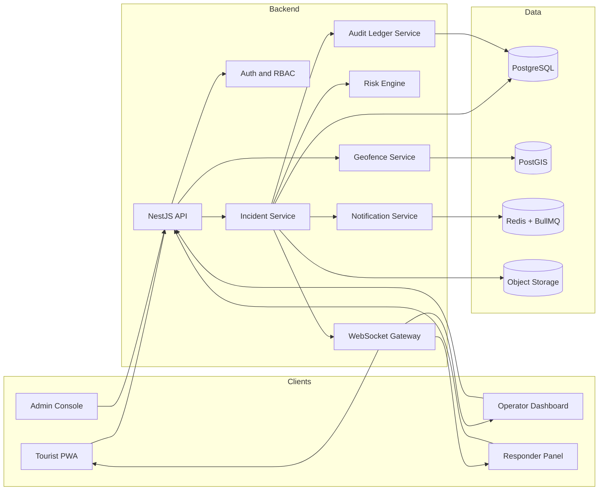

# AtlasGuard

## Software Requirements Specification and Project Bible

**Version:** 1.0  
**Date:** June 2026  
**Project type:** Full-stack public-safety operations platform  
**Build style:** Phase-by-phase MVP, not a bloated enterprise build  
**Primary goal:** Build a serious, demoable, real-time tourist safety and incident response system.

---

# 1. Executive Summary

AtlasGuard is a real-time tourist safety and incident response platform for high-footfall and high-risk travel zones. It gives tourists a temporary safety profile, geofence alerts, one-tap SOS, evidence upload, and live incident status. It gives police, tourism operators, and responders a shared command dashboard for incident triage, responder assignment, live maps, response timelines, notifications, and tamper-evident audit records.

The project must not become a generic tourism app. It must not become hotel booking, travel recommendations, or a chatbot. The heart of AtlasGuard is this operational loop:

```text
Tourist enters risky zone
-> geofence warning appears
-> tourist triggers SOS
-> incident appears live on command dashboard
-> operator acknowledges and assigns responder
-> responder updates field status
-> tourist sees help status
-> audit timeline records every action
```

The product should feel like a serious operational system, not a student CRUD app. Every feature should support one of four outcomes:

1. Reduce emergency response latency.
2. Improve coordination between tourist, operator, and responder.
3. Improve visibility of risky zones and active incidents.
4. Preserve accountability through audit trails and clear status history.

---

# 2. Product Vision

## 2.1 Vision Statement

AtlasGuard helps tourists travel safer by connecting them with local safety operators and responders through real-time SOS workflows, geospatial monitoring, and accountable incident response.

## 2.2 One-line Pitch

AtlasGuard is a real-time tourist safety and incident response system that connects travelers, police, tourism operators, and responders through geofence alerts, SOS workflows, live maps, responder dispatch, and tamper-evident incident records.

## 2.3 What the Product Is

AtlasGuard is:

- A tourist safety PWA/web app.
- A police/tourism command dashboard.
- A responder field panel.
- A geospatial incident management system.
- A workflow engine for SOS -> acknowledgement -> dispatch -> resolution.
- A tamper-evident timeline for every incident.

## 2.4 What the Product Is Not

AtlasGuard is not:

- A tourism recommendation app.
- A hotel or trip booking app.
- A generic map app.
- A chatbot-first product.
- A fake blockchain showcase.
- A fully production-ready emergency system for real-life deployment without government certification.
- A replacement for official emergency numbers or police systems.

## 2.5 Product Identity

The project should be presented as a safety coordination platform. The strongest positioning is:

> Public-facing tourist safety + multi-role incident command + geospatial intelligence + auditability.

---

# 3. Problem Statement

Tourist destinations, pilgrimage routes, remote areas, festivals, hill stations, beaches, border regions, and high-crowd zones often face safety coordination problems. Tourists may not know local emergency contacts, operators may not know where tourists are, responders may receive incomplete incident information, and authorities may lack a shared operational view.

Common problems include:

- Tourists entering unsafe or restricted zones without warning.
- Delayed communication during emergencies.
- No unified dashboard for active tourist incidents.
- No structured responder assignment workflow.
- Poor incident accountability and weak audit history.
- Difficulty prioritizing high-risk incidents.
- Lack of visibility into incident density and zone-level risk.

AtlasGuard solves this by creating a connected safety workflow between tourists, operators, and responders.

---

# 4. Objectives and Success Metrics

## 4.1 Primary Objectives

| ID | Objective | Meaning |
|---|---|---|
| OBJ-1 | Fast SOS creation | A tourist can trigger an SOS in one action. |
| OBJ-2 | Live command visibility | Operators see incidents on a live map and queue. |
| OBJ-3 | Structured response | Every incident follows clear states from creation to resolution. |
| OBJ-4 | Responder coordination | Operators can assign responders and track progress. |
| OBJ-5 | Risk awareness | Tourists receive geofence warnings and operators see risk zones. |
| OBJ-6 | Accountability | Every action is stored in a tamper-evident audit timeline. |
| OBJ-7 | Demo clarity | A complete emergency scenario can be demonstrated end-to-end. |

## 4.2 Success Metrics for V1

| Metric | Target for Demo V1 |
|---|---|
| SOS creation latency | Under 2 seconds locally/deployed demo environment |
| Live dashboard update | Under 3 seconds via WebSocket event |
| Incident state transitions | 100 percent state machine controlled |
| Audit event coverage | Every major incident action creates an audit event |
| Geofence detection | Works for seeded risk zones and simulated tourist movement |
| Demo completion | Full SOS -> dispatch -> resolved demo in under 5 minutes |
| Accessibility baseline | Main tourist flow keyboard usable and mobile responsive |

---

# 5. Scope

## 5.1 V1 Scope

AtlasGuard V1 includes:

- Tourist registration and login.
- Role-based accounts: tourist, operator, responder, admin.
- Tourist safety profile.
- Trip/session creation.
- Risk zones displayed on map.
- Geofence alert simulation.
- SOS incident creation.
- Operator command dashboard.
- Incident queue and map.
- Responder assignment.
- Responder field panel.
- Incident status updates.
- Evidence upload: photo/text initially; audio later if time allows.
- Notification records and mock delivery.
- Hash-chained audit timeline.
- Explainable risk scoring.
- Seeded demo scenario.
- README, architecture doc, demo script, and deployment.

## 5.2 Explicit Non-Scope for V1

Do not build these in V1:

- Hotel booking.
- Tourism recommendations.
- Payment system.
- Real government/police integration.
- Real Aadhaar/KYC integration.
- Real blockchain network.
- Native mobile app if PWA is not complete.
- Complex ML model.
- Voice assistant.
- Multi-city production scale.
- Terraform/Kubernetes/Grafana before core product works.
- Offline-first sync engine beyond basic retry indicators.

## 5.3 Stretch Scope

Only after V1 works:

- Daily audit hash anchoring.
- Real SMS/email provider.
- Offline incident draft queue.
- Safe-route suggestion.
- Heatmap analytics.
- Multi-language UI.
- Responder mobile PWA mode.
- Public status page for tourist families.
- Incident export PDF.

---

# 6. Stakeholders and Users

## 6.1 Stakeholders

| Stakeholder | Interest |
|---|---|
| Tourists | Need safety alerts, SOS, and response visibility. |
| Tourism Department | Needs monitoring, reports, and safer destination management. |
| Police/Command Operators | Need active incident visibility and responder coordination. |
| Field Responders | Need assigned cases and simple status updates. |
| Admins | Need zone configuration, users, policies, and audit review. |
| Emergency Contacts | May need alerts when a tourist triggers SOS. |

## 6.2 User Roles

| Role | Description | Main Interface |
|---|---|---|
| TOURIST | Traveler using safety app. | Tourist PWA |
| OPERATOR | Control room user monitoring incidents. | Command dashboard |
| RESPONDER | Field person assigned to incidents. | Responder panel |
| ADMIN | System manager configuring zones/users/rules. | Admin console |

## 6.3 Role Permissions

| Action | Tourist | Operator | Responder | Admin |
|---|---:|---:|---:|---:|
| Create trip | Yes | No | No | Yes |
| Trigger SOS | Yes | No | No | No |
| View own incident | Yes | No | No | Yes |
| View all incidents | No | Yes | No | Yes |
| Assign responder | No | Yes | No | Yes |
| Update assigned incident | No | No | Yes | Yes |
| Configure risk zones | No | No | No | Yes |
| View audit logs | Own only | Yes | Assigned only | Yes |
| Manage users | No | No | No | Yes |

---

# 7. Core Product Workflows

## 7.1 Tourist Onboarding Workflow

```text
Tourist opens app
-> signs up or logs in
-> completes safety profile
-> adds emergency contact
-> creates active trip
-> receives temporary safety ID
-> sees map with safe/risk zones
```

Acceptance criteria:

- Tourist can create an account.
- Tourist can create/edit safety profile.
- Tourist can create one active trip.
- Tourist receives a generated safety ID for demo purposes.

## 7.2 Geofence Alert Workflow

```text
Tourist location changes
-> system checks if point is inside risk zone
-> if inside high-risk zone, alert is created
-> tourist sees warning
-> operator dashboard may show geofence breach if configured
-> audit event is stored
```

Acceptance criteria:

- Seeded risk zones appear on the map.
- Simulated location can enter a risk polygon.
- Alert appears on tourist screen.
- Optional dashboard alert appears for operators.

## 7.3 SOS Workflow

```text
Tourist presses SOS
-> incident is created with location and profile context
-> risk score is calculated
-> incident event SOS_TRIGGERED is logged
-> WebSocket event notifies operator dashboard
-> notification job is queued
-> tourist sees incident tracking page
```

Acceptance criteria:

- SOS button creates a new incident.
- Incident appears live on command dashboard.
- Incident includes location, tourist, trip, status, severity, and created time.
- Audit timeline contains SOS_TRIGGERED.

## 7.4 Operator Triage Workflow

```text
Operator sees incident
-> opens incident details
-> reviews risk factors, tourist profile, and location
-> acknowledges incident
-> assigns responder
-> responder receives assignment
-> audit timeline updates
```

Acceptance criteria:

- Operator can acknowledge an incident.
- Operator can assign an available responder.
- State changes from CREATED to ACKNOWLEDGED to ASSIGNED.
- Dashboard updates without manual refresh.

## 7.5 Responder Workflow

```text
Responder logs in
-> sees assigned incidents
-> accepts assignment
-> marks dispatched
-> marks reached
-> adds note/evidence
-> marks resolved
```

Acceptance criteria:

- Responder sees only assigned incidents.
- Responder can update status according to allowed transitions.
- Tourist and operator see status changes live.
- Audit timeline records each transition.

## 7.6 Incident Closure Workflow

```text
Responder marks resolved
-> operator reviews details
-> operator closes incident
-> system verifies audit chain
-> final report becomes available
```

Acceptance criteria:

- Incident can be resolved and closed.
- Closed incidents become read-only except admin notes.
- Audit integrity status is shown as verified or broken.

---

# 8. Incident State Machine

## 8.1 Incident States

```text
CREATED
ACKNOWLEDGED
ASSIGNED
DISPATCHED
REACHED
RESOLVED
CANCELLED
```

## 8.2 Allowed Transitions

| From | To | Actor |
|---|---|---|
| CREATED | ACKNOWLEDGED | OPERATOR, ADMIN |
| CREATED | CANCELLED | TOURIST, OPERATOR, ADMIN |
| ACKNOWLEDGED | ASSIGNED | OPERATOR, ADMIN |
| ASSIGNED | DISPATCHED | RESPONDER |
| DISPATCHED | REACHED | RESPONDER |
| REACHED | RESOLVED | RESPONDER, OPERATOR |
| ASSIGNED | CANCELLED | OPERATOR, ADMIN |
| DISPATCHED | CANCELLED | OPERATOR, ADMIN |

## 8.3 Invalid State Rules

- A responder cannot update an incident not assigned to them.
- A tourist cannot mark an incident as resolved.
- A closed incident cannot return to active state.
- Every state transition must create an incident event and audit record.

---

# 9. Functional Requirements

## 9.1 Authentication and Authorization

| ID | Requirement | Priority |
|---|---|---|
| FR-AUTH-1 | Users can sign up and log in. | Must |
| FR-AUTH-2 | System supports TOURIST, OPERATOR, RESPONDER, ADMIN roles. | Must |
| FR-AUTH-3 | Backend enforces role-based access control. | Must |
| FR-AUTH-4 | JWT access token and refresh token flow is supported. | Should |
| FR-AUTH-5 | Demo accounts are seeded. | Must |

## 9.2 Tourist App Requirements

| ID | Requirement | Priority |
|---|---|---|
| FR-TOURIST-1 | Tourist can create and edit safety profile. | Must |
| FR-TOURIST-2 | Tourist can create active trip. | Must |
| FR-TOURIST-3 | Tourist can view map with risk zones. | Must |
| FR-TOURIST-4 | Tourist receives geofence warning. | Must |
| FR-TOURIST-5 | Tourist can trigger SOS. | Must |
| FR-TOURIST-6 | Tourist can upload evidence. | Should |
| FR-TOURIST-7 | Tourist can see incident status updates. | Must |
| FR-TOURIST-8 | Tourist can cancel accidental SOS before acknowledgement. | Should |

## 9.3 Operator Dashboard Requirements

| ID | Requirement | Priority |
|---|---|---|
| FR-OPS-1 | Operator sees live incident queue. | Must |
| FR-OPS-2 | Operator sees incidents on map. | Must |
| FR-OPS-3 | Operator can acknowledge incident. | Must |
| FR-OPS-4 | Operator can assign responder. | Must |
| FR-OPS-5 | Operator can filter incidents by severity/status. | Should |
| FR-OPS-6 | Operator sees risk score explanation. | Must |
| FR-OPS-7 | Operator sees audit timeline. | Must |
| FR-OPS-8 | Operator can close incident after resolution. | Should |

## 9.4 Responder Requirements

| ID | Requirement | Priority |
|---|---|---|
| FR-RESP-1 | Responder sees assigned incidents. | Must |
| FR-RESP-2 | Responder can mark dispatched. | Must |
| FR-RESP-3 | Responder can mark reached. | Must |
| FR-RESP-4 | Responder can mark resolved. | Must |
| FR-RESP-5 | Responder can add field notes. | Should |
| FR-RESP-6 | Responder can upload evidence. | Could |

## 9.5 Admin Requirements

| ID | Requirement | Priority |
|---|---|---|
| FR-ADMIN-1 | Admin can create/edit risk zones. | Must |
| FR-ADMIN-2 | Admin can manage responders. | Must |
| FR-ADMIN-3 | Admin can view audit logs. | Must |
| FR-ADMIN-4 | Admin can configure alert rules. | Should |
| FR-ADMIN-5 | Admin can export incident report. | Could |

## 9.6 Audit Requirements

| ID | Requirement | Priority |
|---|---|---|
| FR-AUDIT-1 | Every incident action creates an event. | Must |
| FR-AUDIT-2 | Events are append-only. | Must |
| FR-AUDIT-3 | Events include previous_hash and current_hash. | Must |
| FR-AUDIT-4 | UI shows audit integrity status. | Should |
| FR-AUDIT-5 | Daily hash anchor is supported. | Stretch |

---

# 10. Non-Functional Requirements

## 10.1 Performance

| ID | Requirement |
|---|---|
| NFR-PERF-1 | Dashboard incident updates should appear within 3 seconds in demo deployment. |
| NFR-PERF-2 | SOS API should respond within 2 seconds for demo load. |
| NFR-PERF-3 | Map should load seeded zones within 3 seconds. |
| NFR-PERF-4 | Risk score calculation should be synchronous and under 500 ms for V1. |

## 10.2 Reliability

| ID | Requirement |
|---|---|
| NFR-REL-1 | Incident creation must not fail silently. |
| NFR-REL-2 | Notification failures must be recorded. |
| NFR-REL-3 | Audit log creation should be part of the same transaction as state updates when possible. |
| NFR-REL-4 | Repeated SOS clicks should be idempotent within a short window. |

## 10.3 Security

| ID | Requirement |
|---|---|
| NFR-SEC-1 | All protected endpoints require authentication. |
| NFR-SEC-2 | Role-based authorization is enforced on backend, not only UI. |
| NFR-SEC-3 | Users cannot access incidents outside their role scope. |
| NFR-SEC-4 | Evidence uploads are validated by type and size. |
| NFR-SEC-5 | Secrets are stored in environment variables, never committed. |

## 10.4 Privacy

| ID | Requirement |
|---|---|
| NFR-PRIV-1 | Tourist location is visible only during active trip/incident in V1. |
| NFR-PRIV-2 | Demo data must not include real personal data. |
| NFR-PRIV-3 | The app clearly states it is a demo and not an official emergency service. |
| NFR-PRIV-4 | Sensitive profile fields are minimized. |

## 10.5 Usability

| ID | Requirement |
|---|---|
| NFR-UX-1 | SOS button is visible and easy to trigger. |
| NFR-UX-2 | Tourist incident status is understandable without technical terms. |
| NFR-UX-3 | Operator dashboard shows the most urgent incidents first. |
| NFR-UX-4 | Responder panel works on mobile screen size. |

---

# 11. Technical Architecture

## 11.1 Recommended V1 Architecture



## 11.2 Simplified Deployment Architecture

```text
Vercel
  - Next.js web app

Render/Fly.io
  - NestJS API
  - Worker process

Managed PostgreSQL
  - relational data
  - PostGIS extension

Redis
  - queues
  - notification jobs
  - optional WebSocket scaling

Cloudinary/S3-compatible storage
  - incident evidence files
```

## 11.3 Why This Architecture Is Enough

This architecture demonstrates serious full-stack ability while staying buildable:

- Real-time updates through WebSockets.
- Geospatial logic through PostGIS.
- Background jobs through Redis/BullMQ.
- Role-based workflows through NestJS guards/policies.
- Auditability through hash-chained database events.
- Clear separation between client, API, data, and worker.

Avoid microservices in V1. A modular monolith is better.

---

# 12. Recommended Tech Stack

## 12.1 Primary Stack

| Layer | Technology | Reason |
|---|---|---|
| Web app | Next.js + TypeScript | Fast full-stack UI, strong ecosystem. |
| UI | Tailwind + shadcn/ui | Clean dashboard quickly. |
| Backend | NestJS | Structured backend, decorators, guards, WebSockets. |
| ORM | Prisma | Fast schema iteration and migrations. |
| DB | PostgreSQL | Reliable relational data. |
| Geo | PostGIS | Proper geospatial queries. |
| Realtime | Socket.IO or NestJS WebSockets | Live incident updates. |
| Queue | Redis + BullMQ | Notifications and retries. |
| Maps | Leaflet first | Simple and free for V1. |
| Storage | Cloudinary or S3-compatible | Evidence uploads. |
| Deployment | Vercel + Render/Fly.io | Simple demo deployment. |

## 12.2 Stack Discipline Rules

Use boring, reliable choices. Do not add tools to look fancy. Every tool must serve a workflow.

Recommended decisions:

- PWA first, not native mobile first.
- Modular monolith first, not microservices.
- Leaflet first, not complex map SDK first.
- Hash-chained audit table first, not blockchain first.
- Explainable scoring first, not ML model first.
- Mock SMS first, real provider later.

---

# 13. Repository Structure

Use this structure for V1:

```text
atlasguard/
├─ apps/
│  ├─ web/
│  └─ api/
├─ packages/
│  └─ shared/
├─ docs/
│  ├─ architecture.md
│  ├─ threat-model.md
│  ├─ api.md
│  ├─ demo-script.md
│  └─ roadmap.md
├─ data/
│  ├─ risk-zones.geojson
│  ├─ seed-users.json
│  └─ seed-incidents.json
├─ docker-compose.yml
├─ README.md
└─ package.json
```

Only add more packages after the app works.

---

# 14. Data Model

## 14.1 Main Entities

| Entity | Purpose |
|---|---|
| User | Login account and role. |
| TouristProfile | Tourist safety and contact details. |
| Trip | Active tourist visit/session. |
| RiskZone | Geospatial zone with risk level. |
| Incident | SOS/emergency case. |
| IncidentEvent | Timeline event for incident state changes. |
| ResponderProfile | Field responder metadata and availability. |
| ResponderAssignment | Links responder to incident. |
| EvidenceFile | Uploaded photo/audio/text evidence. |
| Notification | Alert delivery record. |
| AuditLog | Append-only tamper-evident audit record. |

## 14.2 Suggested Tables

### users

| Field | Type | Notes |
|---|---|---|
| id | uuid | Primary key |
| name | text | Display name |
| email | text | Unique |
| password_hash | text | Hashed password |
| role | enum | TOURIST, OPERATOR, RESPONDER, ADMIN |
| status | enum | ACTIVE, SUSPENDED |
| created_at | timestamp | Auto |
| updated_at | timestamp | Auto |

### tourist_profiles

| Field | Type | Notes |
|---|---|---|
| id | uuid | Primary key |
| user_id | uuid | FK users |
| phone | text | Demo phone allowed |
| emergency_contact_name | text | Optional |
| emergency_contact_phone | text | Optional |
| medical_notes | text | Optional, keep minimal |
| mobility_needs | text | Optional |
| language_preference | text | Optional |
| created_at | timestamp | Auto |

### trips

| Field | Type | Notes |
|---|---|---|
| id | uuid | Primary key |
| tourist_id | uuid | FK tourist profile |
| destination_name | text | Example: Gangtok, Pelling, etc. |
| start_date | date | Trip start |
| end_date | date | Trip end |
| safety_id | text | Generated temporary ID |
| status | enum | ACTIVE, COMPLETED, CANCELLED |
| created_at | timestamp | Auto |

### risk_zones

| Field | Type | Notes |
|---|---|---|
| id | uuid | Primary key |
| name | text | Zone name |
| description | text | Risk reason |
| risk_level | enum | LOW, MEDIUM, HIGH, CRITICAL |
| polygon | geography/geometry | PostGIS polygon |
| active | boolean | Whether zone is active |
| created_by | uuid | Admin user |
| created_at | timestamp | Auto |

### incidents

| Field | Type | Notes |
|---|---|---|
| id | uuid | Primary key |
| tourist_id | uuid | FK tourist profile |
| trip_id | uuid | FK trip |
| type | enum | SOS, GEOFENCE_BREACH, MEDICAL, LOST, HARASSMENT, OTHER |
| status | enum | CREATED, ACKNOWLEDGED, ASSIGNED, DISPATCHED, REACHED, RESOLVED, CANCELLED |
| severity | enum | LOW, MEDIUM, HIGH, CRITICAL |
| latitude | decimal | Incident location |
| longitude | decimal | Incident location |
| risk_score | integer | 0-100 |
| risk_explanation | jsonb | Reasons for score |
| description | text | Tourist/operator note |
| created_at | timestamp | Auto |
| updated_at | timestamp | Auto |

### incident_events

| Field | Type | Notes |
|---|---|---|
| id | uuid | Primary key |
| incident_id | uuid | FK incidents |
| actor_id | uuid | User who performed action |
| event_type | enum | SOS_TRIGGERED, ACKNOWLEDGED, ASSIGNED, DISPATCHED, REACHED, RESOLVED, CANCELLED, NOTE_ADDED |
| metadata | jsonb | Extra details |
| previous_hash | text | Previous event hash |
| current_hash | text | Current event hash |
| created_at | timestamp | Auto |

### responders

| Field | Type | Notes |
|---|---|---|
| id | uuid | Primary key |
| user_id | uuid | FK users |
| phone | text | Contact |
| unit_name | text | Police/tourism unit |
| availability_status | enum | AVAILABLE, BUSY, OFFLINE |
| last_latitude | decimal | Optional |
| last_longitude | decimal | Optional |

### responder_assignments

| Field | Type | Notes |
|---|---|---|
| id | uuid | Primary key |
| incident_id | uuid | FK incidents |
| responder_id | uuid | FK responders |
| assigned_by | uuid | Operator/admin |
| status | enum | ASSIGNED, ACCEPTED, COMPLETED, CANCELLED |
| assigned_at | timestamp | Auto |
| completed_at | timestamp | Optional |

### evidence_files

| Field | Type | Notes |
|---|---|---|
| id | uuid | Primary key |
| incident_id | uuid | FK incidents |
| uploaded_by | uuid | User ID |
| file_url | text | Storage URL |
| file_type | text | image/audio/text |
| description | text | Optional |
| created_at | timestamp | Auto |

### notifications

| Field | Type | Notes |
|---|---|---|
| id | uuid | Primary key |
| user_id | uuid | Recipient |
| incident_id | uuid | Optional |
| channel | enum | IN_APP, EMAIL, SMS, PUSH |
| status | enum | PENDING, SENT, FAILED, MOCKED |
| payload | jsonb | Notification data |
| attempts | integer | Retry count |
| created_at | timestamp | Auto |
| sent_at | timestamp | Optional |

---

# 15. API Design

## 15.1 API Principles

- Use REST for standard CRUD and workflow actions.
- Use WebSockets for live incident and status updates.
- Keep APIs role-protected.
- State-changing actions must create audit events.
- Avoid exposing raw internal database details.

## 15.2 Auth APIs

| Method | Endpoint | Purpose |
|---|---|---|
| POST | /auth/register | Create account |
| POST | /auth/login | Login |
| POST | /auth/refresh | Refresh token |
| POST | /auth/logout | Logout |
| GET | /auth/me | Current user |

## 15.3 Tourist APIs

| Method | Endpoint | Purpose |
|---|---|---|
| GET | /tourist/profile | Get own profile |
| PUT | /tourist/profile | Update own profile |
| POST | /trips | Create trip |
| GET | /trips/active | Get active trip |
| POST | /incidents/sos | Trigger SOS |
| GET | /incidents/my | Get own incidents |
| GET | /incidents/:id/status | Track incident |
| POST | /incidents/:id/evidence | Upload evidence |

## 15.4 Operator APIs

| Method | Endpoint | Purpose |
|---|---|---|
| GET | /ops/incidents | List incidents |
| GET | /ops/incidents/:id | Incident details |
| POST | /ops/incidents/:id/acknowledge | Acknowledge incident |
| POST | /ops/incidents/:id/assign | Assign responder |
| POST | /ops/incidents/:id/close | Close resolved incident |
| GET | /ops/responders | List responders |
| GET | /ops/dashboard/summary | Dashboard metrics |

## 15.5 Responder APIs

| Method | Endpoint | Purpose |
|---|---|---|
| GET | /responder/assignments | My assigned incidents |
| POST | /responder/incidents/:id/accept | Accept incident |
| POST | /responder/incidents/:id/dispatched | Mark dispatched |
| POST | /responder/incidents/:id/reached | Mark reached |
| POST | /responder/incidents/:id/resolved | Mark resolved |
| POST | /responder/incidents/:id/notes | Add field note |

## 15.6 Admin APIs

| Method | Endpoint | Purpose |
|---|---|---|
| GET | /admin/users | List users |
| POST | /admin/responders | Create responder |
| GET | /admin/risk-zones | List zones |
| POST | /admin/risk-zones | Create zone |
| PUT | /admin/risk-zones/:id | Update zone |
| DELETE | /admin/risk-zones/:id | Disable zone |
| GET | /admin/audit | View audit logs |

## 15.7 WebSocket Events

| Event | Direction | Payload |
|---|---|---|
| incident.created | Server -> operators | Incident summary |
| incident.updated | Server -> relevant users | Incident ID, status, updated fields |
| responder.assigned | Server -> responder | Assignment details |
| geofence.alert | Server -> tourist/operator | Zone and alert data |
| notification.created | Server -> user | Notification data |
| audit.verified | Server -> operator/admin | Integrity result |

---

# 16. Geospatial Design

## 16.1 Risk Zones

Risk zones are polygons stored in PostGIS. Each zone has a risk level and reason.

Example zone types:

- Landslide-prone route.
- Restricted area.
- High-crowd festival zone.
- Unsafe night area.
- Remote low-connectivity area.
- Medical support sparse area.

## 16.2 Geofence Check

Input:

- Tourist latitude.
- Tourist longitude.
- Active trip ID.

Output:

- Inside zone: true/false.
- Matched zone IDs.
- Highest risk level.
- Warning message.

V1 can support simulated location movement. Real GPS can come later.

## 16.3 Nearest Responder Calculation

Use Haversine formula or PostGIS distance query.

Input:

- Incident location.
- Available responder locations.

Output:

- Nearest responder.
- Distance estimate.
- Suggested assignment.

---

# 17. Risk Scoring Engine

## 17.1 Goal

The risk engine should be simple, explainable, and demoable. It should not be a fake AI black box.

## 17.2 Input Factors

| Factor | Example Weight |
|---|---:|
| Zone risk level | 0-30 |
| Time of day | 0-15 |
| Incident type | 0-20 |
| Tourist medical/mobility flag | 0-15 |
| Distance from nearest responder | 0-10 |
| Active incidents nearby | 0-10 |

## 17.3 Example Scoring Logic

```text
score = 0

if zone == HIGH: score += 25
if zone == CRITICAL: score += 30
if time is night: score += 10
if incident type is MEDICAL: score += 20
if tourist has medical notes: score += 10
if nearest responder distance > 5 km: score += 10
if nearby active incidents > 3: score += 10
```

## 17.4 Severity Mapping

| Score | Severity |
|---:|---|
| 0-30 | LOW |
| 31-55 | MEDIUM |
| 56-80 | HIGH |
| 81-100 | CRITICAL |

## 17.5 Explanation Output

Every risk score must produce reasons:

```json
{
  "score": 78,
  "severity": "HIGH",
  "reasons": [
    "Tourist is inside high-risk zone",
    "Incident occurred at night",
    "Nearest responder is 6.2 km away",
    "Tourist has medical dependency flag"
  ]
}
```

---

# 18. Audit Ledger Design

## 18.1 Why Audit Matters

Emergency workflows require accountability. AtlasGuard should record who did what and when. The audit ledger makes the system look serious without overbuilding blockchain.

## 18.2 Event Hashing

For each incident event:

```text
current_hash = SHA256(
  incident_id + actor_id + event_type + metadata + created_at + previous_hash
)
```

## 18.3 Audit Chain Rules

- Every incident has its own event chain.
- First event uses previous_hash = "GENESIS".
- Each new event points to the previous event hash.
- Events are append-only.
- Editing old events is not allowed.
- UI can verify chain integrity by recalculating hashes.

## 18.4 Example Timeline

```text
10:41 AM - SOS_TRIGGERED - Tourist
10:42 AM - OPERATOR_ACKNOWLEDGED - Operator
10:43 AM - RESPONDER_ASSIGNED - Operator
10:45 AM - RESPONDER_DISPATCHED - Responder
10:51 AM - RESPONDER_REACHED - Responder
10:58 AM - INCIDENT_RESOLVED - Responder
```

UI should show:

```text
Audit integrity: Verified
```

## 18.5 Stretch Blockchain Feature

After V1:

- Generate daily root hash of all incident chains.
- Store daily root hash in a signed local record or testnet transaction.
- Do not make blockchain the main product.

---

# 19. Notification System

## 19.1 Channels

V1 channels:

- In-app notification.
- Mock SMS.
- Mock email.

Stretch:

- Real SMS provider.
- Push notifications.
- WhatsApp alert integration.

## 19.2 Queue Rules

Notifications should be queued through BullMQ:

```text
incident.created -> notify operators
responder.assigned -> notify responder
status.updated -> notify tourist
geofence.alert -> notify tourist
```

## 19.3 Notification Record

Every notification attempt should be stored with status:

```text
PENDING -> SENT
PENDING -> FAILED
PENDING -> MOCKED
```

---

# 20. Security and Privacy Design

## 20.1 Security Principles

- Backend authorization is mandatory.
- Do not trust client-side role checks.
- Every incident action must verify actor permissions.
- Evidence files must be validated.
- API inputs must be validated with DTO schemas.
- Rate-limit SOS endpoint per user.
- Protect admin endpoints.

## 20.2 Privacy Principles

- Collect only required tourist safety data.
- Use demo data only.
- Do not store real Aadhaar/passport details.
- Show clear demo disclaimer.
- Location sharing should be tied to active trip/incident.
- Avoid exposing emergency contact details to unauthorized users.

## 20.3 Threat Model Summary

| Threat | Mitigation |
|---|---|
| Fake incident spam | Auth, rate limits, duplicate SOS detection. |
| Unauthorized incident access | RBAC and ownership checks. |
| Audit tampering | Hash chain and append-only events. |
| Evidence abuse | File validation, size limits, signed URLs. |
| Role escalation | Backend guards and admin-only user management. |
| Location privacy leak | Scope location visibility by active incident/role. |

---

# 21. Offline and Retry Behavior

Do not build a complex offline engine in V1. Build simple, honest behavior:

- If network is unavailable, show clear error.
- For SOS, allow one local pending state in UI.
- Retry when connection returns.
- Show whether the SOS reached the server.
- Never pretend help is coming until server confirms incident creation.

Stretch:

- Service worker queue for offline incident drafts.
- SMS fallback instructions.
- Local emergency number card.

---

# 22. UI Screens Checklist

## 22.1 Tourist Screens

- Login/register.
- Safety profile form.
- Active trip creation.
- Safety ID page.
- Tourist map page.
- SOS confirmation page.
- Incident tracking page.
- Alert history page.

## 22.2 Operator Screens

- Command dashboard home.
- Live incident queue.
- Map with incident pins and risk zones.
- Incident detail drawer/page.
- Assign responder modal.
- Audit timeline panel.
- Analytics summary.

## 22.3 Responder Screens

- Assigned incidents list.
- Incident detail page.
- Status update buttons.
- Notes/evidence form.

## 22.4 Admin Screens

- Risk zone management.
- Responder management.
- User management.
- Audit log search.
- Demo scenario seeder.

---

# 23. Phase-by-Phase Build Plan

This is the most important section. Build exactly in this order.

## Phase 0 - Project Setup and Discipline

**Goal:** Create the foundation without overengineering.

Build:

- Monorepo setup.
- Next.js app.
- NestJS API.
- PostgreSQL + Prisma.
- Docker Compose for local DB.
- Shared TypeScript types package.
- Basic README.
- Environment variable examples.

Do not build:

- Terraform.
- Kubernetes.
- Native mobile.
- Blockchain.
- Complex UI.

Definition of done:

- `pnpm dev` or equivalent starts web and API.
- API health check works.
- Database migration works.
- README has local setup.

## Phase 1 - Auth, Roles, and Basic Shell

**Goal:** Users can log in and see role-specific dashboards.

Build:

- User model.
- Password hashing.
- Login/register.
- JWT auth.
- RBAC guards.
- Seed demo accounts.
- Dashboard layout.
- Tourist, operator, responder, admin route protection.

Demo accounts:

```text
tourist@demo.com / password123
operator@demo.com / password123
responder@demo.com / password123
admin@demo.com / password123
```

Definition of done:

- User logs in.
- User sees correct dashboard.
- Wrong role cannot access protected page/API.

## Phase 2 - Tourist Profile, Trip, and Safety ID

**Goal:** Tourist has an active safety context.

Build:

- Tourist profile form.
- Emergency contact fields.
- Active trip creation.
- Temporary safety ID generation.
- Safety ID display page.

Definition of done:

- Tourist creates profile.
- Tourist creates active trip.
- Safety ID is generated and visible.

## Phase 3 - SOS Incident Workflow

**Goal:** Complete the core operational loop without maps first.

Build:

- Incident table.
- SOS endpoint.
- Incident queue on operator dashboard.
- Acknowledge action.
- Responder list.
- Assign responder action.
- Responder assignment panel.
- Status transitions.
- Tourist tracking page.
- WebSocket updates.

Definition of done:

- Tourist triggers SOS.
- Operator sees incident live.
- Operator assigns responder.
- Responder updates status.
- Tourist sees status change.

This phase is the heart of the product. Do not move ahead until this works.

## Phase 4 - Maps and Geofencing

**Goal:** Make the project visually and technically strong.

Build:

- Leaflet map.
- Seeded risk zones from GeoJSON.
- Incident pins.
- Responder pins.
- Tourist simulated location.
- Point-in-polygon geofence check.
- Geofence warning UI.
- Operator map layer filters.

Definition of done:

- Risk zones display.
- Tourist can simulate entering a zone.
- Alert appears.
- Incident appears on map.

## Phase 5 - Audit Ledger, Notifications, and Evidence

**Goal:** Add operational seriousness.

Build:

- Incident events table.
- Hash-chained event creation.
- Audit timeline UI.
- Audit integrity verification.
- BullMQ notification queue.
- Mock SMS/email logs.
- Evidence upload.

Definition of done:

- Every incident action creates an audit event.
- Timeline is visible.
- Integrity verifies as true.
- Notification records are created.
- Evidence can be attached.

## Phase 6 - Risk Scoring, Analytics, and Demo Polish

**Goal:** Make the demo memorable.

Build:

- Explainable risk scoring.
- Severity badges.
- Dashboard analytics cards.
- Active incidents by severity.
- Average response time.
- Seed demo scenario.
- One-click simulation button.
- Final README and demo video script.

Definition of done:

- Risk score appears with reasons.
- Dashboard has meaningful metrics.
- Demo scenario can be run end-to-end in under 5 minutes.

---

# 24. Testing Strategy

## 24.1 Unit Tests

Test:

- Risk scoring function.
- Incident state transition rules.
- Audit hash generation.
- Role authorization helpers.
- Geofence point-in-polygon logic.

## 24.2 Integration Tests

Test:

- SOS creation creates incident and audit event.
- Acknowledge updates incident state.
- Assignment creates responder assignment and event.
- Invalid state transition is rejected.
- Wrong role cannot access incident.

## 24.3 End-to-End Tests

Test one golden path:

```text
Tourist login
-> create trip
-> trigger SOS
-> operator acknowledges
-> operator assigns responder
-> responder marks dispatched/reached/resolved
-> tourist sees resolved
```

Use Playwright if time allows.

## 24.4 Manual Demo QA Checklist

Before recording demo:

- Demo accounts work.
- Seed data loads.
- Map loads correctly.
- WebSocket updates work.
- Audit timeline is visible.
- No console errors during main demo.
- README setup works on a clean clone.

---

# 25. Deployment Plan

## 25.1 Environments

| Environment | Purpose |
|---|---|
| Local | Development |
| Demo/Staging | Public demo deployment |
| Production-like | Optional later |

## 25.2 V1 Deployment

Recommended:

- Web: Vercel.
- API: Render/Fly.io.
- DB: Managed PostgreSQL with PostGIS.
- Redis: Render/Fly.io Redis or Upstash if compatible.
- Storage: Cloudinary.

## 25.3 Environment Variables

Example:

```text
DATABASE_URL=
JWT_ACCESS_SECRET=
JWT_REFRESH_SECRET=
REDIS_URL=
CLOUDINARY_CLOUD_NAME=
CLOUDINARY_API_KEY=
CLOUDINARY_API_SECRET=
WEB_ORIGIN=
NODE_ENV=
```

Never commit real `.env` files.

---

# 26. Demo Script

## 26.1 Five-minute Demo

1. Open tourist app.
2. Tourist creates/opens active trip.
3. Show safety ID.
4. Open map and simulate entering a high-risk zone.
5. Show geofence warning.
6. Tourist presses SOS.
7. Switch to operator dashboard.
8. Show live incident appearing on map and queue.
9. Operator opens incident and sees risk explanation.
10. Operator acknowledges and assigns responder.
11. Switch to responder panel.
12. Responder marks dispatched and reached.
13. Tourist sees help status update.
14. Responder resolves incident.
15. Operator shows audit timeline with verified integrity.

## 26.2 Demo Story

Use this story:

```text
A tourist is visiting a remote high-risk viewpoint during evening hours. The system detects that the tourist has entered a high-risk zone and sends a warning. The tourist feels unsafe and triggers SOS. The command center receives the incident live, sees that the incident is high risk because it is night and the tourist is inside a red zone, and assigns the nearest available responder. The responder updates field status, the tourist sees help is coming, and the final incident timeline is stored with tamper-evident audit records.
```

---

# 27. README Requirements

Your README should include:

- Project name and one-line pitch.
- Problem statement.
- Core roles.
- Demo video/GIF.
- Screenshots.
- Architecture diagram.
- Tech stack.
- Features.
- Local setup.
- Demo accounts.
- Environment variables.
- API overview.
- Database schema overview.
- Security/privacy notes.
- Audit ledger explanation.
- Phase roadmap.
- Known limitations.
- Future work.

Do not write a weak README. The README is part of the product.

---

# 28. Code Quality Rules

## 28.1 Backend Rules

- Use DTO validation.
- Keep services small.
- Use transactions for incident update + event creation.
- Do not duplicate state transition logic.
- Keep role guards centralized.
- Use enums for roles and incident statuses.
- Log important errors.

## 28.2 Frontend Rules

- Use shared API client.
- Keep role-specific layouts separate.
- Build reusable status badges.
- Avoid giant components.
- Handle loading/error/empty states.
- Keep SOS UI simple and obvious.

## 28.3 Database Rules

- Use migrations.
- Add indexes for incident status, created_at, and location.
- Seed demo data.
- Avoid storing unnecessary personal data.

---

# 29. Acceptance Criteria Summary

AtlasGuard V1 is complete when:

- All four roles can log in.
- Tourist can create trip and trigger SOS.
- Operator receives live incident.
- Operator can assign responder.
- Responder can update status.
- Tourist sees incident progress.
- Risk zones appear on map.
- Geofence alert works in demo.
- Every incident action has audit event.
- Audit integrity can be verified.
- Evidence upload works or is clearly marked as stretch if unfinished.
- Demo scenario runs smoothly.
- README explains architecture and setup.
- Project is deployed or locally runnable with clean setup.

---

# 30. Risk Register

| Risk | Impact | Mitigation |
|---|---|---|
| Scope creep | Project never finishes | Follow phases strictly. |
| Maps take too long | Core workflow delayed | Build SOS workflow before maps. |
| Blockchain distraction | Wasted time | Use hash-chain audit first. |
| UI polish too early | No working backend | Build backend workflow first. |
| Real SMS issues | Demo failure | Use mock notification log first. |
| Too many roles | Confusing UX | Keep four roles only. |
| Complex AI | Unfinished project | Use explainable rule-based risk scoring. |

---

# 31. Future Roadmap

## V1.1

- Real SMS/email provider.
- Incident report export.
- Better admin analytics.
- Better mobile PWA polish.

## V1.2

- Offline SOS draft queue.
- Multi-language support.
- Safe-route suggestions.
- Emergency contact portal.

## V2

- Multi-region deployment.
- Real command-center integrations.
- Heatmap analytics.
- Daily audit hash anchoring.
- Policy-based data retention.

## V3

- Native mobile apps.
- Advanced risk prediction.
- Integration with public emergency systems.
- High-availability deployment.

---

# 32. How to Use This Document While Building

Use this document as your execution controller. Do not ask the coding agent to build everything at once.

Correct usage:

```text
Implement Phase 1 only. Follow the SRS. Do not add features outside Phase 1. After coding, list what is complete, what is missing, and how to run it.
```

Bad usage:

```text
Build the full AtlasGuard app with all features.
```

For each phase:

1. Copy the phase section.
2. Give it to the coding agent.
3. Ask for implementation only for that phase.
4. Run the project.
5. Fix errors.
6. Commit.
7. Move to next phase only after definition of done is satisfied.

---

# 33. Final Build Principle

AtlasGuard should be judged by one question:

> Can a tourist trigger an emergency and can we watch the whole response system move live?

If the answer is yes, the project is strong.

Everything else is secondary.
