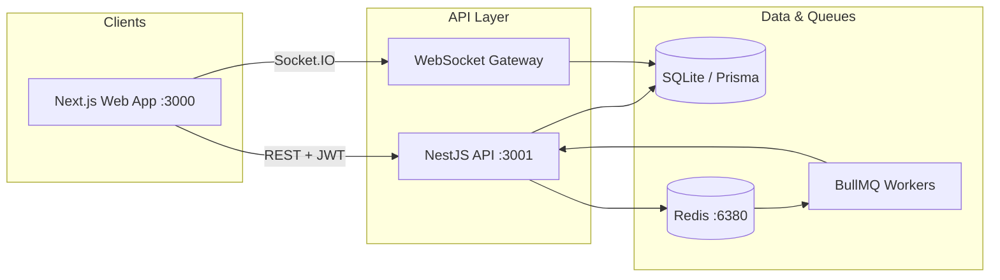

# AtlasGuard

Tourist safety and incident response platform — monorepo with NestJS API, Next.js web app, and shared TypeScript packages.

## Prerequisites

- Node.js 20+
- npm 10+
- Docker Desktop (for Redis on Windows)

## Quick Start

```bash
# Install dependencies
npm install

# Start Redis (port 6380 — avoids conflict with legacy Redis on 6379)
npm run infra:up

# Build all packages
npm run build:all

# Terminal 1 — API (port 3001)
cd apps/api
npx prisma migrate deploy
npx prisma db seed
npm run dev

# Terminal 2 — Web (port 3000)
cd apps/web
npm run dev
```

Open http://localhost:3000 and log in with a demo account below.

## Demo Accounts

All demo accounts use password: `password123`

| Role      | Email               |
|-----------|---------------------|
| Tourist   | tourist@demo.com    |
| Operator  | operator@demo.com   |
| Responder | responder@demo.com|
| Admin     | admin@demo.com      |

Seed or reset demo data:

```bash
curl -X POST http://127.0.0.1:3001/admin/seed \
  -H "Authorization: Bearer <admin-token>"
```

One-click demo scenario (clears open incidents, sets medical/mobility profile, auto-triggers MEDICAL SOS at Remote North, acknowledges for analytics):

```bash
curl -X POST http://127.0.0.1:3001/admin/simulate-demo \
  -H "Authorization: Bearer <admin-token>"
```

## Architecture



| Layer | Technology | Responsibility |
|-------|------------|----------------|
| Web | Next.js 14, React | Role-based dashboards, maps, SOS UX |
| API | NestJS, Prisma | Auth, incidents, geofence, risk scoring, audit |
| Shared | TypeScript package | Types, risk scoring rules, demo constants |
| Realtime | Socket.IO | Live incident updates, geofence alerts |
| Jobs | BullMQ + Redis | Async notifications (mocked delivery in demo) |
| Storage | SQLite | Demo-friendly embedded database |

## Core Roles

| Role | Primary capabilities |
|------|---------------------|
| **Tourist** | Safety profile, active trip, SOS trigger, safety map, geofence awareness |
| **Operator** | Incident queue, risk analysis, acknowledge/assign/dispatch, ops map, analytics |
| **Responder** | View assigned incidents, update status (dispatched → reached → resolved) |
| **Admin** | User overview, risk zone management, audit feed, one-click demo simulation |

## Database Schema Overview

SQLite via Prisma (`apps/api/prisma/schema.prisma`):

| Table | Purpose |
|-------|---------|
| `users` | Accounts with role (`TOURIST`, `OPERATOR`, `RESPONDER`, `ADMIN`) |
| `tourist_profiles` | Phone, emergency contacts, medical notes, mobility needs |
| `trips` | Active tourism sessions with `safetyId` |
| `risk_zones` | GeoJSON polygons with `LOW` / `MEDIUM` / `HIGH` / `CRITICAL` levels |
| `incidents` | SOS records with risk score, severity, status state machine |
| `incident_events` | Tamper-evident hash-chained audit trail per incident |
| `responder_profiles` | Unit info, availability, last known position |
| `responder_assignments` | Operator → responder dispatch links |
| `evidence_files` | Uploaded incident evidence metadata |
| `notifications` | In-app / mocked outbound notification log |
| `audit_logs` | Cross-cutting admin audit feed |

## Privacy & Security

- **Demo disclaimer:** This repository is a demonstration prototype. Do not deploy with default passwords or SQLite in production without hardening.
- **RBAC:** JWT authentication with role guards on every protected route (`@Roles` decorator).
- **Audit chain:** Incident events are SHA-256 hash-linked; `GET /incidents/:id/audit/verify` validates integrity.
- **Data minimization:** Tourist medical and mobility fields are used only for risk scoring context — not shared outside operator/responder views.
- **Transport:** Use HTTPS and secure cookie/token storage in any real deployment.

## Phase Roadmap

| Phase | Focus | Status |
|-------|-------|--------|
| 0 | Monorepo scaffold, auth, profiles | ✅ Complete |
| 1 | Trips, SOS, incident state machine | ✅ Complete |
| 2 | Operator dispatch, responder workflow | ✅ Complete |
| 3 | Geofence zones, live map, WebSocket | ✅ Complete |
| 4 | Risk zones admin, tourist map UX | ✅ Complete |
| 5 | Audit chain, notifications, evidence | ✅ Complete |
| 6 | Risk scoring (Bible §17.2), analytics, one-click demo | ✅ Complete |

## Phase 6 Features

- **Risk scoring** at SOS trigger — geofence zone (CRITICAL/HIGH/MEDIUM), night hours, incident type (MEDICAL), medical notes, mobility needs, responder distance, nearby incidents
- **Dashboard analytics** at `GET /ops/dashboard/summary` (severity breakdown, avg acknowledge time)
- **Risk explanation panel** on operator, tourist, and responder UIs
- **One-click demo** at `POST /admin/simulate-demo` — auto SOS + operator acknowledge with realistic analytics

See `docs/demo-script.md` for the 5-minute walkthrough.

## Known Limitations

- SQLite single-writer — E2E tests run with `workers: 1` to avoid lock contention
- Notification delivery is mocked (records created, no real SMS/email)
- Risk zones are seeded from static GeoJSON; no live weather or crowd data
- Geofence checks are point-in-polygon only (no route corridor prediction)
- Redis is required for BullMQ but optional for core REST flows in minimal dev setups
- Screenshot assets are documented in `docs/screenshots/README.md` but not generated in CI

## Screenshots

Capture UI screenshots locally following `docs/screenshots/README.md`. Suggested set:

- Login and role dashboards
- Tourist safety map with zone overlays
- Operator queue + Risk Analysis panel
- Admin demo control with auto-created incident ID
- Audit ledger integrity view

## Infrastructure

```bash
npm run infra:up      # Start Redis via Docker Compose
npm run infra:down    # Stop containers
npm run infra:logs    # Tail Redis logs
```

Redis is exposed on **port 6380** (mapped from container 6379) because Windows often has Redis 3.0 bound to 6379.

Set `REDIS_URL=redis://127.0.0.1:6380` in `apps/api/.env` if needed.

## Project Structure

```
apps/
  api/     NestJS REST + WebSocket API
  web/     Next.js operator/tourist/responder/admin dashboards
packages/
  shared/  Shared types, risk scoring logic, demo locations
tests/
  e2e/     Playwright API + browser E2E tests
data/
  risk-zones.geojson
docs/
  demo-script.md
  demo-video-script.md
  screenshots/README.md
```

## Scripts

| Command | Description |
|---------|-------------|
| `npm run build:all` | Build shared, API, and web |
| `npm run dev:api` | API watch mode |
| `npm run dev:web` | Next.js dev server |
| `npm run test:shared` | Unit tests (risk scoring) |

## E2E Tests

With API running on port 3001 and Web on port 3000:

```bash
cd tests/e2e
npm install
npx playwright test src/phase6-risk-analytics.spec.ts
```